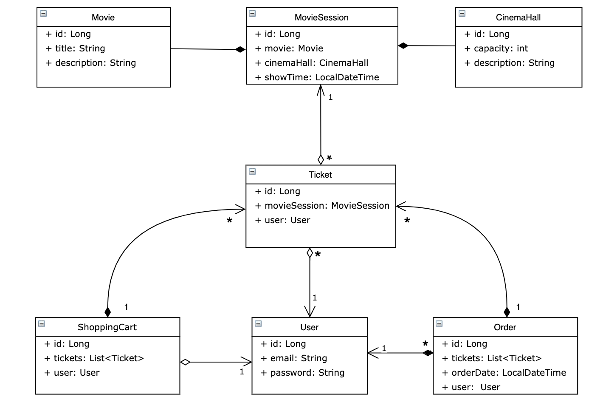

#  CINEMA-APP


#  DESCRIPTION

This demo-project is a web-based application designed as a cinema service model.

The application offers features such as user authentication, registration, and CRUD operations.

The service is constructed using Hibernate and Spring frameworks, 
adhering to fundamental REST and SOLID principles.


#  Features
- Log in / authentication / authorization <br />
- Add / get / get all movies <br />
- Add / get / get all cinema halls <br />
- Add / get / find available movie sessions <br />
- Add a session / find by user / register & delete a shopping cart <br />
- Complete order / get a history of orders <br />


#  Structure

#### Project 

<pre>
├───java 
│   └───cinema
│       ├───config             ---- Application configuration classes
│       ├───controller         ---- User request processing controllers
│       ├───dao                ---- The dao layer facilitates data management operations
│       ├───dto                ---- Database data transfer classes
│       │   ├───request 
│       │   └───response 
│       ├───exception          ---- Custom exception
│       │   └───data processing                    
│       ├───lib                ---- Custom annotations
│       │   ├───fields value match 
│       │   └───valid email 
│       ├───model              ---- Project models 
│       │   ├───cinema hall 
│       │   ├───movie 
│       │   ├───movie session
│       │   ├───order 
│       │   ├───role
│       │   ├───shopping card
│       │   ├───ticket
│       │   └───user             
│       ├───service             ---- The service layer encapsulates the business logic 
│       └───util                ---- Date pattern manager  
└───resources                      


</pre>

#### Database



#  Used Technologies
- JDK 17 <br />
- MAVEN 4.0.0 <br />
- MYSQL 8.0.32 <br />
- SPRING 5.3.20 <br />
- SPRING SECURITY 5.6.10 <br />
- HIBERNATE 5.6.14 <br />
- JAVA SERVLETS 4.0.1 <br />
- JACKSON CORE 2.14.1 <br />
- TOMCAT 9.0.50 <br />

#  Getting Started
#### Prerequisites:
- Java 17 or later <br />
- Apache Tomcat 9 (version 9.0.50 is recommended) <br />
- MySQL 8 or later <br />
- Spring 5 or later <br />
- Hibernate 5 or later <br />

#### Install process
1. Clone this repository.
2. Open the project in your IDE and build it. 
3. Open the db.properties file (/src/main/resources/db.properties) and change the information about database connection.
    
    

4. Configure Tomcat. 
    #### Use only Tomcat 9
   - choose war exploded <br />
   - leave only "/" in the application context <br />
   
5. Launch and use.

#### Testing process
1. Register at [Postman](https://www.postman.com/).
2. You can test next role access to specific resources for `ADMIN` and for `USER`.
```
POST: /register - all
GET: /cinema-halls - user/admin
POST: /cinema-halls - admin
GET: /movies - user/admin
POST: /movies - admin
GET: /movie-sessions/available - user/admin
POST: /movie-sessions - admin
PUT: /movie-sessions/{id} - admin
DELETE: /movie-sessions/{id} - admin
GET: /orders - user
POST: /orders/complete - user
PUT: /shopping-carts/movie-sessions - user
GET: /shopping-carts/by-user - user
GET: /users/by-email - admin
...
``` 

# Authors
#### Viktoriia Svidovska
